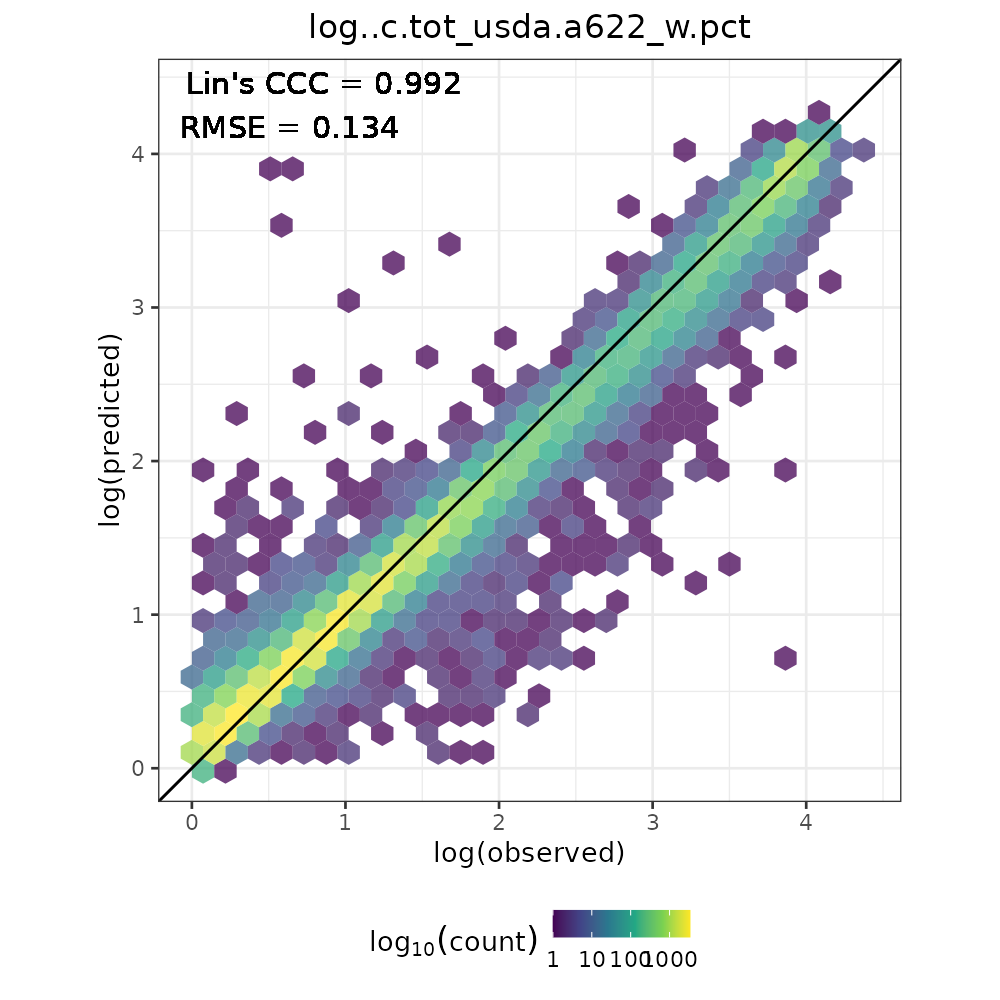

[](https://doi.org/10.5281/zenodo.5759693)

[](https://soilspectroscopy.org/)

[](http://creativecommons.org/licenses/by-sa/4.0/)

This work is licensed under a [Creative Commons Attribution-ShareAlike 4.0 International License](http://creativecommons.org/licenses/by-sa/4.0/).

```{r init, include=FALSE}
library(captioner)
fig_nums <- captioner(prefix = "Fig.")
```

## Open Soil Spectral Library

Part of: <https://github.com/soilspectroscopy>  
Project: [Soil Spectroscopy for Global Good](https://soilspectroscopy.org)  
Last update: `r Sys.Date()`  
Dataset: [OSSL](https://soilspectroscopy.github.io/ossl-manual/ossl-database-description.html)  

```{r, include=FALSE}
options(warn=0)
```

```{r packages, echo=FALSE, message=FALSE, results='hide'}
packages <- c("tidyverse", "qs", "parallel", "lubridate",
              "mlr3verse", "mlr3extralearners", "mlr3pipelines",
              "yardstick")
new.packages <- packages[!(packages %in% installed.packages()[,"Package"])]
if(length(new.packages)) install.packages(new.packages)
invisible(lapply(packages, library, character.only = TRUE))
```

The directory/folder path:

```{r dir, include=TRUE, message=FALSE, eval=TRUE}
# dir <- "/mnt/soilspec4gg/ossl/ossl_models/mlr3/"
dir <- "~/mnt-ossl/ossl_models/"
# db.dir <- "/mnt/soilspec4gg/ossl/ossl_import/"
db.dir <- "~/mnt-ossl/ossl_import/"
```

### Overview

This tutorial explains the steps required to fit Global Soil Spectral Calibration Models for the purpose of the [Soil Spectroscopy for Global Good project](https://soilspectroscopy.org) using the [MLR3 framework](https://mlr3book.mlr-org.com/).

The following code is implemented in a high-performance computing environment with many steps fully parallelized with enough RAM (> 64GB). Running this code on a standard computer without subsetting data is not recommended.

For each soil property of interest, the possible model combinations are:

```{r model_config, include=TRUE, message=FALSE, eval=TRUE}
# MIR, VisNIR and NIR from Neospectra
spectra.type <- c("mir", "visnir", "nir.neospectra")

# Using KSSL only or the whole OSSL
subset <- c("kssl", "ossl")

# Adding (ll) or not adding (na) geocovariates to models
geocovariates <- c("na")

# Basic structure
modeling.combinations <- tibble(spectra_type = spectra.type) %>%
  crossing(subset = subset) %>%
  crossing(geo = geocovariates)
```

At this stage, Neospectra models are fitted using only the OSSL subset, as they have minimal differences (OSSL ~ KSSL). In addition, models with geocovariates are omitted as additional tests are required.

```{r model_names, include=TRUE, message=FALSE, eval=TRUE}
# Target models
modeling.combinations <- modeling.combinations %>%
  dplyr::filter(!(grepl("neospectra", spectra_type) & subset == "kssl")) %>%
  dplyr::filter(!(geo == "ll"))

# Model name
modeling.combinations <- modeling.combinations %>%
  mutate(model_name = paste0(spectra_type, "_cubist_",
                             subset, "_", geo, "_v1.2"), .before = 1)

modeling.combinations %>%
  knitr::kable()
```

After database update v1.2, the following properties of interest have models fitted:

```{r soil_properties, include=TRUE, message=FALSE, eval=TRUE}
soil.properties <- read_csv("../out/ossl_models_soil_properties.csv")

soil.properties <- soil.properties %>%
  filter(include == TRUE) %>%
  mutate(export_name = ifelse(log == TRUE, paste0("log..", soil_property), soil_property)) %>%
  select(-include, -log)

soil.properties.names <- soil.properties %>%
  pull(soil_property)

knitr::kable(soil.properties)
```
Note: some soil properties are natural-log transformed to help models fitting.

Final modeling combinations:
```{r modeling_combinations, include=TRUE, message=FALSE, eval=FALSE}
modeling.combinations <- soil.properties %>%
  crossing(modeling.combinations)

write_csv(modeling.combinations, "../out/modeling_combinations_v1.2.csv")
```

## Spectral ranges

Few datasets from the OSSL have distinct spectral ranges. We strictly define them in the chunk below and format the the OSSL naming. MIR is represented in [log10 absorbance units](https://soilspectroscopy.github.io/ossl-manual/ossl-database-description.html#mir-table), while the VisNIR and NIR are represented in [reflectance units](https://soilspectroscopy.github.io/ossl-manual/ossl-database-description.html#mir-table).
```{r spectral_ranges, include=TRUE, message=FALSE, eval=TRUE}
mir.spectral.range <- paste0("scan_mir.", seq(600, 4000, by = 2), "_abs")
visnir.spectral.range <- paste0("scan_visnir.", seq(400, 2500, by = 2), "_ref")
nir.neospectra.spectral.range <- paste0("scan_nir.", seq(1350, 2550, by = 2), "_ref")
```

## Checking folders

```{r export_dirs, include=TRUE, message=FALSE, eval=FALSE}
target.dirs <- paste0(dir, soil.properties$export_name)

# Folders already created?
invisible(sapply(target.dirs, function(x) {
  if(!dir.exists(x)){dir.create(x)}
}))
```

## Loading regression matrix

The regression-matrices were produced in the [OSSL-imports repository](https://github.com/soilspectroscopy/ossl-imports).

```{r data_import, include=TRUE, message=FALSE, eval=FALSE}
## Reading OSSL level 1
rm.ossl <- qread(paste0(db.dir, "ossl_all_L1_v1.2.qs"))

# Preparing the bind of soil data level 1 for Neospectra 
neospectra.soillab <- rm.ossl %>%
  dplyr::select(id.layer_uuid_txt, id.scan_local_c,
                all_of(soil.properties.names)) %>%
  filter(grepl("XS|XN", id.scan_local_c)) %>%
  mutate(id.scan_local_c = gsub("XS|XN", "", id.scan_local_c))

# Keeping only the important columns
rm.ossl <- rm.ossl %>%
  dplyr::select(id.layer_uuid_txt, dataset.code_ascii_txt,
                any_of(soil.properties.names), all_of(visnir.spectral.range), all_of(mir.spectral.range))

# head(names(rm.ossl), 20)
# tail(names(rm.ossl), 20)

## Reading Neospectra datasets
neospectra.nir <- qread(paste0(db.dir, "neospectra_nir_v1.2.qs"))

# head(names(neospectra.nir), 20)

# Averaging spectra collected by multiple instruments
neospectra.nir <- neospectra.nir %>%
  dplyr::select(id.sample_local_c, all_of(nir.neospectra.spectral.range)) %>%
  group_by(id.sample_local_c) %>%
  summarise_all(mean)

rm.neospectra <- inner_join(neospectra.soillab, neospectra.nir,
                            by = c("id.scan_local_c" = "id.sample_local_c"))

# Selecting only important columns
rm.neospectra <- rm.neospectra %>%
  dplyr::select(id.layer_uuid_txt,
                any_of(soil.properties.names), all_of(nir.neospectra.spectral.range))

# Preparing named list of datasets
# Selecting only important columns, spectra range and rows with available spectra
data.list <- list(
  "mir_mlr3..eml_kssl_v1.2" = {rm.ossl %>%
      dplyr::filter(dataset.code_ascii_txt == "KSSL.SSL") %>%
      dplyr::select(id.layer_uuid_txt, any_of(soil.properties.names),
                    all_of(mir.spectral.range)) %>%
      dplyr::filter(!is.na(scan_mir.1500_abs))},
  "mir_mlr3..eml_ossl_v1.2" = {rm.ossl %>%
      dplyr::select(id.layer_uuid_txt, any_of(soil.properties.names),
                    all_of(mir.spectral.range)) %>%
      dplyr::filter(!is.na(scan_mir.1500_abs))},
  "visnir_mlr3..eml_kssl_v1.2" = {rm.ossl %>%
      dplyr::filter(dataset.code_ascii_txt == "KSSL.SSL") %>%
      dplyr::select(id.layer_uuid_txt, any_of(soil.properties.names),
                    all_of(visnir.spectral.range)) %>%
      dplyr::filter(!is.na(scan_visnir.1500_ref))},
  "visnir_mlr3..eml_ossl_v1.2" = {rm.ossl %>%
      dplyr::select(id.layer_uuid_txt, any_of(soil.properties.names),
                    all_of(visnir.spectral.range)) %>%
      dplyr::filter(!is.na(scan_visnir.1500_ref))},
  "nir.neospectra_mlr3..eml_ossl_v1.2" = {rm.neospectra %>%
      dplyr::select(id.layer_uuid_txt, any_of(soil.properties.names),
                    all_of(nir.neospectra.spectral.range)) %>%
      dplyr::filter(!is.na(scan_nir.1500_ref))}
  )

# # Different sizes
# lapply(data.list, function(x) dim(x))
```

### Preprocessing

To remove baseline offset, additive/multiplicative scattering effects, and multicollinearity of spectra from multiple sources, [SNV](https://cran.r-project.org/web/packages/prospectr/vignettes/prospectr.html#scatter-and-baseline-corrections) preprocessing is used before PCA compression and model calibration:

```{r preprocessing, include=TRUE, message=FALSE, eval=FALSE}
prep.list <- lapply(data.list, function(x){
  x %>%
    dplyr::select(-id.layer_uuid_txt, -any_of(soil.properties.names)) %>%
    as.matrix() %>%
    prospectr::standardNormalVariate(X = .) %>%
    as_tibble() %>%
    bind_cols({x %>%
      dplyr::select(id.layer_uuid_txt, any_of(soil.properties.names))}, .)
  })

# # Checking preprocessing. Names are kept consistently across list objects and table columns
# lapply(data.list, function(x) dim(x))
```

### PCA compression

Compress and save [PCA models](http://www.sthda.com/english/articles/31-principal-component-methods-in-r-practical-guide/118-principal-component-analysis-in-r-prcomp-vs-princomp/) for the different versions of spectra. This is used to reduce the number of dimension and also control multicollinearity [@chang2001near]. Only 120 components will be used in the models but the remaining deeper components are used for the trustworthiness test.

Objects from `prcomp`:  
- `sdev`: the standard deviations of the principal components.  
- `rotation`: the matrix of variable loadings (columns are eigenvectors).  
- `center`: the variable means (means that were substracted).  
- `scale`: the variable standard deviations (the scaling applied to each variable).    
- `x`: the coordinates of the individuals (observations) on the principal components, known as scores.  

We can omit the `x` in the objects to save to disk, later reassigning the class `prcomp` for making predictions. 

Fit PCA models in parallel:

```{r pca_compression, include=TRUE, message=FALSE, eval=FALSE}
pca.list <- mclapply(1:length(prep.list), function(i) {
  
  x <- prep.list[[i]] %>%
    dplyr::select(starts_with("scan_")) %>%
    as.data.frame()
  
  prcomp(x, center = T, scale = T)
  
}, mc.cores = length(prep.list))

names(pca.list) <- names(prep.list)

# # Checking the number of components of each spectra type
# lapply(pca.list, function(x) ncol(x$rotation))
# 
# # Checking how many components explain 95% of the original variance
# lapply(pca.list, function(x) {which(cumsum(x$sdev/sum(x$sdev)) > 0.95)[1]})
# 
# # Checking how many components explain 99% of the original variance
# lapply(pca.list, function(x) {which(cumsum(x$sdev/sum(x$sdev)) > 0.99)[1]})
# 
# # Checking how many components explain 99.9%of the original variance
# lapply(pca.list, function(x) {which(cumsum(x$sdev/sum(x$sdev)) > 0.999)[1]})
# 
# # Checking how many components explain 99.99% of the original variance
# lapply(pca.list, function(x) {which(cumsum(x$sdev/sum(x$sdev)) > 0.9999)[1]})
```

Saving as `qs` files:

```{r pca_export, include=TRUE, message=FALSE, eval=FALSE}
## Saving simplified pca models only for prediction purposes (m = modified):
# Omitting 5th object of prcomp, i.e x table (scores)
for(i in 1:length(pca.list)){
  qsave(pca.list[[i]][1:4], paste0(dir, "pca.ossl/mpca_", names(pca.list)[i], ".qs"))
}

## Saving the scores to be used as predictors
for(i in 1:length(pca.list)){
  
  idata <- prep.list[[i]] %>%
    dplyr::select(id.layer_uuid_txt, all_of(soil.properties.names))
  
  iscores <- pca.list[[i]]$x %>%
    as_tibble()
  
  idata.export <- bind_cols(idata, iscores)
  
  qsave(idata.export, paste0(dir, "pca.ossl/pca_scores_", names(pca.list)[i], ".qs"))
  
}
```

## Target models

```{r count, include=TRUE, message=FALSE, eval=TRUE}
modeling.combinations <- read_csv("../out/modeling_combinations_v1.2.csv")
count.table <- read_csv("../out/tab_dataset_count.csv")

# Defining available data from ossl-import
count.table <- count.table %>%
  filter(dataset %in% c("KSSL.SSL", "OSSL")) %>%
  rename(subset = dataset) %>%
  mutate(subset = recode(subset,
                         "KSSL.SSL" = "kssl",
                         "OSSL" = "ossl")) %>%
  pivot_longer(-all_of(c("soil_property", "subset")),
               names_to = "spectra_type", values_to = "count") %>%
  mutate(spectra_type = recode(spectra_type,
                               "n_mir" = "mir",
                               "n_visnir" = "visnir",
                               "n_neospectra" = "nir.neospectra"))

# Defining models with at least 500 observations
modeling.combinations <- left_join(modeling.combinations,
                                   count.table,
                                   by = c("soil_property", "spectra_type", "subset"))

modeling.combinations <- modeling.combinations %>%
  filter(count > 500) %>%
  filter(!(soil_property == "efferv_usda.a479_class"))

write_csv(modeling.combinations, "../out/fitted_modeling_combinations_v1.2.csv")

# Available soil properties
modeling.combinations %>%
  distinct(soil_property) %>%
  count()

# Final modeling combinations
modeling.combinations %>%
  count(spectra_type, subset)

# # Filtering already fitted models
# modeling.combinations <- modeling.combinations %>%
#   mutate(fitted = file.exists(paste0(dir, export_name, "/model_", model_name, ".qs")))
# 
# modeling.combinations <- modeling.combinations  %>%
#   filter(!fitted)
```

## Model fitting

For calibration model fitting we use the first 120 PCs, a cutoff considering the tradeoff between spectral representation and compression level. We did a internal experiment and found this number to be optimal when compared to a cumulative explained variance of 99%. In addition, this internal experiment demonstrated that climate geocovariates haven't helped the models, but further tests must be done.

The use of compressed PCs is presented in @chang2001near, although the authors used only top 10 PCA components.

The following framework is used:  
- Ensemble machine learning (`mlr3..eml`) composed of a linear regression (meta-learner) of base learners.  
- Base learners: Elastic net (`glmnet`), Random Forest (`ranger`), XGBoost trees (`xgboost`), and Cubist (`cubist`).  
- Calibration (`insample`) from base learners are used as input for the the meta-learner.
- Hyperparameter optimization is done with internal resampling (`inner`) using 5-fold cross-validation and a smaller subset for speeding up this operation. This task is performed with random search of HP space testing up to 20 configurations and RMSE set as the loss function. The final model with the best HPO is fitted at the end with the full data.  
- Final evaluation is performed with external (`outer`) 10-fold cross (`cv10`) validation of final models.  
- Cross-validation predictions, accuracy plot and good-of-fitness metrics are exported to disk.

```{r train, include=TRUE, message=FALSE, eval=FALSE, results='hide'}
## Parallelization is done inside the the autotuner
lgr::get_logger("mlr3")$set_threshold("warn")
future::plan("multisession")
  
i=1
for(i in 1:nrow(modeling.combinations)) {

  isoil_property = modeling.combinations[[i,"soil_property"]]
  imodel_name = modeling.combinations[[i,"model_name"]]
  iexport_name = modeling.combinations[[i,"export_name"]]
  ispectra_type = modeling.combinations[[i,"spectra_type"]]
  isubset = modeling.combinations[[i,"subset"]]
  igeo = modeling.combinations[[i,"geo"]]

  # Learners
  learner_glmnet = lrn("regr.glmnet", predict_type = "response")
  
  learner_ranger = lrn("regr.ranger", predict_type = "response",
                       replace = TRUE, num.threads = 1, verbose = FALSE)
  
  learner_xgboost = lrn("regr.xgboost", predict_type = "response",
                        booster = "gbtree", nthread = 1,
                        subsample = 0.67)
  
  learner_cubist = lrn("regr.cubist", predict_type = "response",
                       neighbors = 0, unbiased = FALSE, seed = 1993)
  
  # Base learners
  base_learners = list(learner_glmnet, learner_ranger, learner_xgboost, learner_cubist)
  
  # Meta learner: linear model of base learners
  learner_lm = lrn("regr.lm", predict_type = "response")

  meta_learner = pipeline_stacking(base_learners, learner_lm,
                                   # method = "cv", folds = 5,
                                   method = "insample",
                                   use_features = FALSE)
  
  # Setting ensemble as a learner
  learner_ensemble = as_learner(meta_learner)
  learner_ensemble$id = "ensemble"
  learner_ensemble$predict_type = "response"

  # Hyperparameters space, all crossed, i.e. not tuned separately
  search_space_ensemble = ps(
    regr.glmnet.alpha = p_dbl(0, 1),
    regr.glmnet.lambda = p_dbl(0.001, 0.1),
    regr.ranger.num.trees = p_int(20, 100),
    regr.ranger.min.node.size = p_int(5, 20),
    regr.xgboost.nrounds = p_int(20, 100),
    regr.xgboost.eta = p_dbl(0.3, 0.5),
    regr.xgboost.max_depth = p_int(5, 20),
    regr.cubist.committees = p_int(5, 10)
  )
  
  # PCA scores
  n.comps <- 120
  selected.comps <- paste0("PC", seq(1, n.comps, by = 1))
  
  data <- qread(paste0(dir, "pca.ossl/pca_scores_", ispectra_type, "_mlr3..eml_", isubset, "_v1.2.qs"))
  
  # Apply log transform to soil property
  if(grepl("log..", iexport_name)){
    
    data <- data %>%
      mutate(!!isoil_property := log1p(!!as.name(isoil_property)))
    
  }
  
  # Defining train data
  if(igeo == "ll") {
    
    sel.data <- data %>%
      select(id.layer_uuid_txt, # ID column
             id.tile, # ID for block CV
             all_of(isoil_property), # Target
             all_of(selected.comps), # Compressed spectra
             starts_with("clm")) %>% # Geocovariates
      filter(!is.na(!!as.name(isoil_property)))
    
  } else if(igeo == "na") {
    
    sel.data <- data %>%
      select(id.layer_uuid_txt, # ID column
             all_of(isoil_property), # Target
             all_of(selected.comps)) %>% # Only compressed spectra
      filter(!is.na(!!as.name(isoil_property)))
    
  }
  
  # Subset for speeding up HPO
  if(nrow(sel.data) >= 2000) {
    
    set.seed(1993)
    sel.data.hpo <- sel.data %>%
      sample_n(2000)
    
  } else {
    
    sel.data.hpo <- sel.data
    
  }
  
  # Exporting train data
  qsave(sel.data, paste0(dir,
                         iexport_name,
                         "/task_",
                         imodel_name,
                         ".qs"))
  
  # Create regression task
  task.hpo <- as_task_regr(sel.data.hpo, id = "hpo", target = isoil_property, type = "regression")
  task.train <- as_task_regr(sel.data, id = "train", target = isoil_property, type = "regression")
  
  # Defining id column
  task.hpo$set_col_roles("id.layer_uuid_txt", roles = "name")
  task.train$set_col_roles("id.layer_uuid_txt", roles = "name")
  
  # For block CV. If 'id.tile' not present in the data.frame, default to random CV
  if("id.tile" %in% colnames(sel.data)) {
    task.hpo$set_col_roles("id.tile", roles = "group")
    task.train$set_col_roles("id.tile", roles = "group")
  }

  # Inner resampling for HPO with 5-fold cv
  inner_resampling = rsmp("cv", folds = 5)

  # Auto tuner
  at = auto_tuner(tuner = tnr("random_search", batch_size = 3), # batch_size X 5 folds = 50 cores
                  learner = learner_ensemble,
                  resampling = inner_resampling,
                  measure = msr("regr.rmse"),
                  search_space = search_space_ensemble,
                  terminator = trm("evals", n_evals = 20),
                  store_models = FALSE)

  # Fit autotuner
  at$train(task.hpo)

  # # Overview
  # at$tuning_result
  # at$tuning_instance
  
  # Final model from best HPO
  final.model <- learner_ensemble
  final.model$param_set$values = at$tuning_result$learner_param_vals[[1]]
  final.model$train(task.train)
  
  # # Overview
  # summary(final.model$model$regr.lm$model)
  
  # Saving trained final model to disk
  qsave(final.model, paste0(dir,
                   iexport_name,
                   "/model_",
                   imodel_name,
                   ".qs"))
  
}
```

## Model evaluation

We can export the summary accuracy statistics and standard plot visualizations for all modeling combinations using 10-fold cross validation.

```{r accuracy, include=TRUE, message=FALSE, eval=FALSE, results='hide'}
fitted.modeling.combinations <- read_csv("../out/fitted_modeling_combinations_v1.2.csv")

## Evaluation pipeline
lgr::get_logger("mlr3")$set_threshold("warn")

i=1
for(i in 1:nrow(fitted.modeling.combinations)) {

  # Parameters
  isoil_property = fitted.modeling.combinations[[i,"soil_property"]]
  imodel_name = fitted.modeling.combinations[[i,"model_name"]]
  iexport_name = fitted.modeling.combinations[[i,"export_name"]]
  ispectra_type = fitted.modeling.combinations[[i,"spectra_type"]]
  isubset = fitted.modeling.combinations[[i,"subset"]]
  igeo = fitted.modeling.combinations[[i,"geo"]]

  cat(paste0("Run ", i, "/", nrow(fitted.modeling.combinations), " at ", lubridate::now(), "\n"))

  # Task
  sel.data <- qread(paste0(dir,
                           iexport_name,
                           "/task_",
                           imodel_name,
                           ".qs"))

  # Create regression task
  task <- as_task_regr(sel.data, id = "train",
                       target = isoil_property,
                       type = "regression")

  # Defining id column
  task$set_col_roles("id.layer_uuid_txt", roles = "name")

  # For block CV. If 'id.tile' not present in the data.frame, default to random CV
  if("id.tile" %in% colnames(sel.data)) {
    task$set_col_roles("id.tile", roles = "group")
  }

  # Autotuned model
  model <- qread(paste0(dir,
                        iexport_name,
                        "/model_",
                        imodel_name,
                        ".qs"))

  # Outer 10-CV evaluation
  tuned_learner <- as_learner(model$graph_model)

  future::plan("multisession")

  set.seed(1993)
  rr = mlr3::resample(task = task,
                      learner = tuned_learner,
                      resampling = rsmp("cv", folds = 10))

  cv.results <- lapply(1:length(rr$predictions("test")), function(i){
    as.data.table(rr$predictions("test")[[i]]) %>%
      mutate(fold = i)})

  cv.results <- Reduce(rbind, cv.results)

  cv.export <- left_join(task$row_names, cv.results, by = c("row_id" = "row_ids")) %>%
    rename(id.layer_uuid_txt = row_name) %>%
    select(-row_id)

  tryCatch(
    expr = {
      qsave(cv.export, paste0(dir,
                              iexport_name,
                              "/cvpred_",
                              imodel_name,
                              ".qs"))
    },
    error = function(e){
      write_csv(cv.export, paste0(dir,
                                  iexport_name,
                                  "/cvpred_",
                                  imodel_name,
                                  ".csv"))
    }
  )

  # Metrics
  performance.metrics <- cv.results %>%
    summarise(n = n(),
              rmse = rmse_vec(truth = truth, estimate = response),
              bias = msd_vec(truth = truth, estimate = response),
              rsq = rsq_vec(truth = truth, estimate = response),
              ccc = ccc_vec(truth = truth, estimate = response, bias = T),
              rpiq = rpiq_vec(truth = truth, estimate = response))

  perfomance.annotation <- paste0("Lin's CCC = ", round(performance.metrics[[1,"ccc"]], 3),
                                  "\nRMSE = ", round(performance.metrics[[1,"rmse"]], 3))

  performance.metrics <- performance.metrics %>%
    mutate(soil_property = isoil_property,
           model_name = imodel_name,
           .before = 1)

  write_csv(performance.metrics, paste0(dir,
                                        iexport_name,
                                        "/perfmetrics_",
                                        imodel_name,
                                        ".csv"))

  # Plot
  if(grepl("log..", iexport_name)) {

    p.hex <- ggplot(cv.results, aes(x = truth, y = response)) +
      geom_hex(bins = 30, alpha = 0.75) +
      geom_abline(intercept = 0, slope = 1) +
      geom_text(aes(x = -Inf, y = Inf, hjust = -0.1, vjust = 1.2),
                label = perfomance.annotation) +
      scale_fill_viridis_c(trans = "log10") +
      labs(x = "log(observed)", y = "log(predicted)", fill = bquote(log[10](count)),
           title = iexport_name) +
      theme_bw(base_size = 10) +
      theme(legend.position = "bottom",
            plot.title = element_text(hjust = 0.5),
            plot.subtitle = element_text(hjust = 0.5),
            legend.key.size = unit(0.35, "cm"))

    r.max <- max(layer_scales(p.hex)$x$range$range)
    r.min <- min(layer_scales(p.hex)$x$range$range)

    s.max <-max(layer_scales(p.hex)$y$range$range)
    s.min <-min(layer_scales(p.hex)$y$range$range)

    t.max <-round(max(r.max,s.max),1)
    t.min <-round(min(r.min,s.min),1)

    p.hex <- p.hex + coord_equal(xlim=c(t.min,t.max),ylim=c(t.min,t.max))

    ggsave(paste0(dir,
                  iexport_name,
                  "/valplot_",
                  imodel_name,
                  ".png"),
           p.hex, dpi = 200, width = 5, height = 5, units = "in", scale = 1)

  } else {

    p.hex <- ggplot(cv.results, aes(x = truth, y = response)) +
      geom_hex(bins = 30, alpha = 0.75) +
      geom_abline(intercept = 0, slope = 1) +
      geom_text(aes(x = -Inf, y = Inf, hjust = -0.1, vjust = 1.2),
                label = perfomance.annotation) +
      scale_fill_viridis_c(trans = "log10") +
      labs(x = "observed", y = "predicted", fill = bquote(log[10](count)),
           title = iexport_name) +
      theme_bw(base_size = 10) +
      theme(legend.position = "bottom",
            plot.title = element_text(hjust = 0.5),
            plot.subtitle = element_text(hjust = 0.5),
            legend.key.size = unit(0.35, "cm"))

    r.max <- max(layer_scales(p.hex)$x$range$range)
    r.min <- min(layer_scales(p.hex)$x$range$range)

    s.max <-max(layer_scales(p.hex)$y$range$range)
    s.min <-min(layer_scales(p.hex)$y$range$range)

    t.max <-round(max(r.max,s.max),1)
    t.min <-round(min(r.min,s.min),1)

    p.hex <- p.hex + coord_equal(xlim=c(t.min,t.max),ylim=c(t.min,t.max))

    ggsave(paste0(dir,
                  iexport_name,
                  "/valplot_",
                  imodel_name,
                  ".png"),
           p.hex, dpi = 200, width = 5, height = 5, units = "in", scale = 1)

  }

  cat(paste0("Run ", i, "/", nrow(fitted.modeling.combinations), "\n\n"))

}

```

Example of an accuracy plot:

```{r ac-toc, echo=FALSE, fig.cap="Accuracy plot for log..c.tot_usda.a622_w.pct using mir_mlr3..eml_ossl_na_v1.2 model", out.width="60%"}

```

## References
