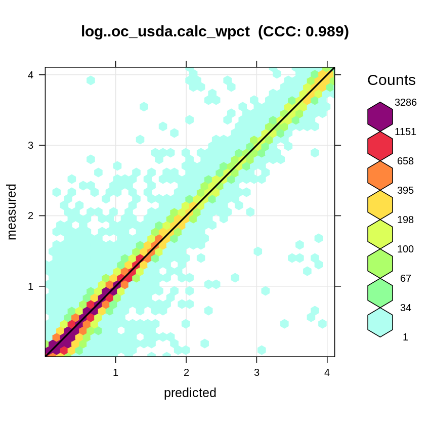

[](https://doi.org/10.5281/zenodo.5759693)

[](https://soilspectroscopy.org/)

[](http://creativecommons.org/licenses/by-sa/4.0/)

This work is licensed under a [Creative Commons Attribution-ShareAlike 4.0 International License](http://creativecommons.org/licenses/by-sa/4.0/).

```{r, include=FALSE}
library(captioner)
fig_nums <- captioner(prefix = "Fig.")
```

## Kellogg Soil Survey Laboratory inputs

Part of: <https://github.com/soilspectroscopy>  
Project: [Soil Spectroscopy for Global Good](https://soilspectroscopy.org)  
Last update: `r Sys.Date()`  
Dataset: [OSSL](https://soilspectroscopy.github.io/ossl-manual/reference-soil-spectroscopy-models.html)  


```{r, include=FALSE}
options(warn=0)
```

This tutorial explains steps required to fit Global Soil Spectral Calibration Models
for the purpose of the [Soil Spectroscopy for Global Good project](https://soilspectroscopy.org).
We use Ensemble Machine Learning with meta-learner / stacking where meta-learner is fitted using 
5-fold Cross-Validation with refitting [@hengl2019predictive].
Modeling is based on using [mlr package](https://mlr.mlr-org.com/) [@bischl2016mlr], which is currently not developed further.
Migration to the newer modeling framework [mlr3](https://mlr3book.mlr-org.com/) in on-going.

The following code runs is implemented in a High Performance Computing environment with
many steps fully parallelized and with enough RAM (>450GB). Running this code on a standard
computer without subsetting data is not recommended.

```{r, echo=FALSE}
ls <- c("rgdal", "raster", "terra", "ranger", "mlr", "parallelMap", "data.table",
        "xgboost", "Cubist", "glmnet", "matrixStats", "doMC", "landmap", "openair",
        "fastDummies", "fastSave")
new.packages <- ls[!(ls %in% installed.packages()[,"Package"])]
if(length(new.packages)) install.packages(new.packages)
x = lapply(ls, require, character.only = TRUE)
```

The directory/folder path:

```{r}
dir = "/mnt/soilspec4gg/ossl/models/"
```

```{r, echo=FALSE, eval=FALSE}
#load.pigz(paste0(dir, "ossl.models.RData"))
source('SSL_functions.R')
```

## Load regression matrix

The regression-matrix was produced by [binding all OSSL tables together](https://github.com/soilspectroscopy/ossl-imports/blob/main/test_bind.R).
It is about 350MB in size.

```{r}
if(!exists("rm.ossl")){
  rep = "http://s3.us-east-1.wasabisys.com/soilspectroscopy/ossl_import/"
  rm.rds = url(paste0(rep, "rm.ossl_v1.rds"), "rb")
  rm.ossl = readRDS(rm.rds)
  rm.ossl$hzn_depth = log1p(rm.ossl$layer.upper.depth_usda_cm + (rm.ossl$layer.lower.depth_usda_cm - rm.ossl$layer.upper.depth_usda_cm)/2)
}
summary(as.factor(rm.ossl$dataset.code_ascii_c))
```

### Indicators

Add indicators i.e. an extra explanatory variable to help with calibration:

```{r}
rm.ossl <- fastDummies::dummy_cols(rm.ossl, select_columns = "dataset.code_ascii_c")
summary(rm.ossl$dataset.code_ascii_c_AFSIS1.SSL)
```

### PCA models

Derive and save [PCA](http://www.sthda.com/english/articles/31-principal-component-methods-in-r-practical-guide/118-principal-component-analysis-in-r-prcomp-vs-princomp/) models for four combinations of spectra:

1. KSSL MIR only;
2. KSSL VisNIR only;
3. ALL MIR;
4. ALL VisNIR;

PCA helps compress spectra data and reduce number of covariates.

```{r}
## Remove CO2 bands from MIR spectra (2389-2268 cm-1)
wv.mir = c(seq(600, 2268, by=2), seq(2390, 4000, by=2))
summary(is.na(rm.ossl$scan_mir.602_abs))
## 62,994
summary(is.na(rm.ossl$scan_mir.3998_abs))
## 62,555
summary(is.na(rm.ossl$scan_visnir.452_pcnt))
## 125,351
summary(is.na(rm.ossl$scan_visnir.2498_pcnt))
## 125,310
spc.lst = list(rm.ossl[rm.ossl$dataset.code_ascii_c=="KSSL.SSL", paste0("scan_mir.", wv.mir, "_abs")],
               rm.ossl[rm.ossl$dataset.code_ascii_c=="KSSL.SSL", paste0("scan_visnir.", seq(350, 2500, by=2), "_pcnt")],
               rm.ossl[, paste0("scan_mir.", wv.mir, "_abs")],
               rm.ossl[, paste0("scan_visnir.", seq(452, 2500, by=2), "_pcnt")])
spc.lst = lapply(spc.lst, function(i){i[complete.cases(i),]})
lapply(spc.lst, dim)
```

Fit PCA models in parallel:

```{r, eval=FALSE}
registerDoMC(length(spc.lst))
pca.lst <- foreach(i=1:length(spc.lst)) %dopar% prcomp(spc.lst[[i]], scale=TRUE)
gc()
pca.names = c("pca_mir_kssl_v1.rds", "pca_visnir_kssl_v1.rds", "pca_mir_ossl_v1.rds", "pca_visnir_ossl_v1.rds")
str(pca.lst[[1]]$x[,1:20])
```

Save as RDS files:

```{r, eval=FALSE}
## save complete objects:
for(i in 1:length(pca.lst)){  saveRDS.gz(pca.lst[[i]], paste0("pca.ossl/", pca.names[i]))  }
pcam.names = paste0("m", c("pca_mir_kssl_v1.rds", "pca_visnir_kssl_v1.rds", "pca_mir_ossl_v1.rds", "pca_visnir_ossl_v1.rds"))
## save models only / for prediction purposes:
for(i in 1:length(pca.lst)){  saveRDS.gz(pca.lst[[i]][1:4], paste0("pca.ossl/", pcam.names[i]))  }
```

## Model fitting

For soil-calibration model fitting we use first 60 PCs. This method was first time introduced by @chang2001near.
We focus on target soil variables for which there is enough training data.

```{r}
n.spc = 60
t.vars = c("log..oc_usda.calc_wpct", "log..n.tot_usda.4h2_wpct", "silt.tot_usda.3a1_wpct",
           "clay.tot_usda.3a1_wpct", "sand.tot_usda.3a1_wpct", "log..ecec_usda.4b4_cmolkg",
           "ph.h2o_usda.4c1_index", "ph.cacl2_usda.4c1_index", "log..al.kcl_usda.4b3_cmolkg",
           "log..k.ext_usda.4b1_cmolkg", "log..caco3_usda.4e1_wpct", "log..mg.ext_usda.4b1_cmolkg",
           "log..ca.ext_usda.4b1_cmolkg", "log..gyp_usda.4e2_wpct",
           "log..cec.ext_usda.4b1_cmolkg", "bsat_usda.4b4_wpct", "bd.od_usda.3b2_gcm3")
which(!gsub("log..", "", t.vars) %in% names(rm.ossl))
x <- lapply(as.vector(unlist(paste0("./models/", t.vars, "/"))), dir.create, recursive=TRUE, showWarnings=FALSE)
```

In addition to PC's we will also use a number of additional covariates:

```{r}
geo.sel = names(rm.ossl)[grep("clm_", names(rm.ossl))]
str(geo.sel)
harm.sel = names(rm.ossl)[grep("dataset.code_ascii_c_", names(rm.ossl))]
```

For each soil property, we basically fit the following six type of models:

1. MIR only KSSL subset `mir_mlr..eml_kssl_na_v1.rds`;
2. MIR only KSSL subset with geographic covariates `mir_mlr..eml_kssl_ll_v1.rds`;
3. VisNIR only ALL data `visnir_mlr..eml_ossl_na_v1.rds`;
4. VisNIR only ALL data with geographic covariates `visnir_mlr..eml_ossl_ll_v1.rds`;
5. VisNIR and MIR fusion `visnir.mir_mlr..eml_ossl_na_v1.rds`;
6. VisNIR and MIR fusion with geographic covariates `visnir.mir_mlr..eml_ossl_ll_v1.rds`;

```{r}
mn.lst = c("mir_mlr..eml_kssl_na_v1", "mir_mlr..eml_kssl_ll_v1", "visnir_mlr..eml_ossl_na_v1",
           "mir_mlr..eml_ossl_ll_v1", "visnir.mir_mlr..eml_ossl_na_v1", "visnir.mir_mlr..eml_ossl_ll_v1")
```


Using geographic covariates implies that lon-lat coordinates are available at relatively high
location accuracy and not higher location error than 1000 m. For each of the models
we specify a list of covariates:

```{r}
## Target 6 models per variable:
pr.lst0 = list(c(paste0("mir.PC", 1:n.spc)),
               c(paste0("mir.PC", 1:n.spc), "hzn_depth", geo.sel),
               c(paste0("visnir.PC", 1:n.spc)),
               c(paste0("mir.PC", 1:n.spc), "hzn_depth", geo.sel, harm.sel),
               c(paste0("mir.PC", 1:n.spc), paste0("visnir.PC", 1:n.spc), harm.sel),
               c(paste0("mir.PC", 1:n.spc), paste0("visnir.PC", 1:n.spc), "hzn_depth", geo.sel, harm.sel))
```

Training takes at least 24hrs on 80t server with 450GB RAM:

```{r, eval=FALSE}
## Run train ----
max.loc.accuracy=1000
## run in parallel for 6 combinations
source('functions_ossl.models.R')
for(tv in t.vars){
  for(k in 1:length(pr.lst0)){
    if(k==1|k==2){
      X.pc = as.data.frame(pca.lst[[1]]$x[,1:n.spc])
      colnames(X.pc) = paste0("mir.PC", 1:n.spc)
    }
    if(k==3){
      X.pc = as.data.frame(pca.lst[[2]]$x[,1:n.spc])
      colnames(X.pc) = paste0("visnir.PC", 1:n.spc)
    }
    if(k==4){
      X.pc = as.data.frame(pca.lst[[3]]$x[,1:n.spc])
      colnames(X.pc) = paste0("mir.PC", 1:n.spc)
    }
    if(k==5|k==6){
      X1.pc = as.data.frame(pca.lst[[3]]$x[,1:n.spc])
      colnames(X1.pc) = paste0("mir.PC", 1:n.spc)
      X2.pc = as.data.frame(pca.lst[[4]]$x[,1:n.spc])
      colnames(X2.pc) = paste0("visnir.PC", 1:n.spc)
      ov.r = intersect(row.names(X1.pc), row.names(X2.pc))
      X.pc = cbind(X1.pc[which(row.names(X1.pc) %in% ov.r),], X2.pc[which(row.names(X2.pc) %in% ov.r),])
    }
    if(nrow(X.pc)>0){
      if(k==1|k==3){
        X = cbind(rm.ossl[as.integer(row.names(X.pc)), c(gsub("log..", "", tv), "ID")], X.pc)
        try( i <- train.ossl(tv, pr.var=pr.lst0[[k]], X, model.name=mn.lst[k], hzn_depth = FALSE) )
        try( i <- train.ossl(tv, pr.var=pr.lst0[[k]], X, model.name=mn.lst[k], hzn_depth = FALSE, rf.feature=FALSE) )
      }
      if(k==2){
        X = cbind(rm.ossl[as.integer(row.names(X.pc)), c(gsub("log..", "", tv), "location.error_any_m", "ID", "hzn_depth", geo.sel)], X.pc)
        X = X[!is.na(X$location.error_any_m) & X$location.error_any_m < max.loc.accuracy,]
        try( i <- train.ossl(tv, pr.var=pr.lst0[[k]], X, model.name=mn.lst[k], hzn_depth = FALSE) )
        try( i <- train.ossl(tv, pr.var=pr.lst0[[k]], X, model.name=mn.lst[k], hzn_depth = FALSE, rf.feature=FALSE) )
      }
      if(k==4|k==6){
        X = cbind(rm.ossl[as.integer(row.names(X.pc)), c(gsub("log..", "", tv), "location.error_any_m", "ID", "hzn_depth", geo.sel, harm.sel)], X.pc)
        X = X[!is.na(X$location.error_any_m) & X$location.error_any_m < max.loc.accuracy,]
        try( i <- train.ossl(tv, pr.var=pr.lst0[[k]], X, model.name=mn.lst[k], hzn_depth = TRUE) )
        try( i <- train.ossl(tv, pr.var=pr.lst0[[k]], X, model.name=mn.lst[k], hzn_depth = TRUE, rf.feature=FALSE) )
      }
      if(k==5){
        X = cbind(rm.ossl[as.integer(row.names(X.pc)), c(gsub("log..", "", tv), "ID", harm.sel)], X.pc)
        try( i <- train.ossl(tv, pr.var=pr.lst0[[k]], X, model.name=mn.lst[k], hzn_depth = FALSE) )
        try( i <- train.ossl(tv, pr.var=pr.lst0[[k]], X, model.name=mn.lst[k], hzn_depth = FALSE, rf.feature=FALSE) )
      }
    }
    try( cat_eml(tv, model.name=mn.lst[k]) )
  }
}
```

## Model evaluation

We can export the summary accuracy statistics for all soil variables into a single table:

```{r, eval=FALSE}
p.lst = c("RMSE", "R.square", "N.tot", "N.outliers")
acc.mat = data.frame(matrix(nrow=length(t.vars), ncol=2+length(mn.lst)*4))
colnames(acc.mat) = c("variable", "std", sapply(mn.lst, function(i){paste0(i, "_", p.lst)}))
acc.mat$variable = t.vars
acc.mat$std = sapply(t.vars, function(i){ if(length(grep("log..", i))>0) { sd(log1p(rm.ossl[,gsub("log..","",i)]), na.rm = TRUE) } else { sd(rm.ossl[,i], na.rm = TRUE) } })
for(i in 1:nrow(acc.mat)){
  for(j in 1:length(mn.lst)){
    in.rds = paste0(dir, t.vars[i], "/", mn.lst[j], ".rds")
    if(file.exists(in.rds)){
      t.m = readRDS.gz(in.rds)
      x.s = summary(t.m$learner.model$super.model$learner.model)
      RMSE = signif(sqrt(sum(t.m$learner.model$super.model$learner.model$residuals^2) / t.m$learner.model$super.model$learner.model$df.residual), 3)
      acc.mat[i,paste0(mn.lst[j], "_RMSE")] = RMSE
      acc.mat[i,paste0(mn.lst[j], "_R.square")] = round(x.s$adj.r.squared, 3)
      acc.mat[i,paste0(mn.lst[j], "_N.tot")] = x.s$df[2]
      acc.mat[i,paste0(mn.lst[j], "_N.outliers")] = sum(abs(x.s$residuals) > 3*RMSE)
      gc()
    }
  }
}
write.csv(acc.mat, "../out/accuracy_matrix_ossl_models.csv")
```

We also produce standard accuracy plots based on the 5-fold cross-validation by using:

```{r, eval=FALSE}
## Accuracy plots ----
library(hexbin)
library(plotKML)
library(lattice)
par(family = "sans")
for(i in 1:nrow(acc.mat)){
  for(j in 1:length(mn.lst)){
    in.rds = paste0(dir, t.vars[i], "/", mn.lst[j], ".rds")
    out.file = paste0(dir, t.vars[i], "/ap.", mn.lst[j], ".rds.png")
    if(file.exists(in.rds) & !file.exists(out.file)){
      t.m = readRDS.gz(in.rds)
      yh = t.m$learner.model$super.model$learner.model$fitted.values
      meas = t.m$learner.model$super.model$learner.model$model[,t.vars[i]]
      t.var.breaks = quantile(meas, c(0.001, 0.01, 0.999), na.rm=TRUE)
      plot_hexbin(varn=t.vars[i], breaks=c(t.var.breaks[1], seq(t.var.breaks[2], t.var.breaks[3], length=25)), meas=ifelse(meas<0, 0, meas), pred=ifelse(yh<0, 0, yh), main=t.vars[i], out.file=out.file, log.plot=FALSE, colorcut=c(0,0.01,0.02,0.03,0.06,0.12,0.20,0.35,1.0))
      #gc()
    }
  }
}
```

Example of an accuracy plot:

```{r ac-soc1, echo=FALSE, fig.cap="Accuracy plot for `log..oc_usda.calc_wpct/mir_mlr..eml_kssl_na_v1.rds`.", out.width="60%"}

```


```{r, eval=FALSE}
#save.image.pigz(file=paste0(dir, "ossl.models.RData"), n.cores=80)
#rmarkdown::render("R-mlr/README.Rmd")
```


## References
