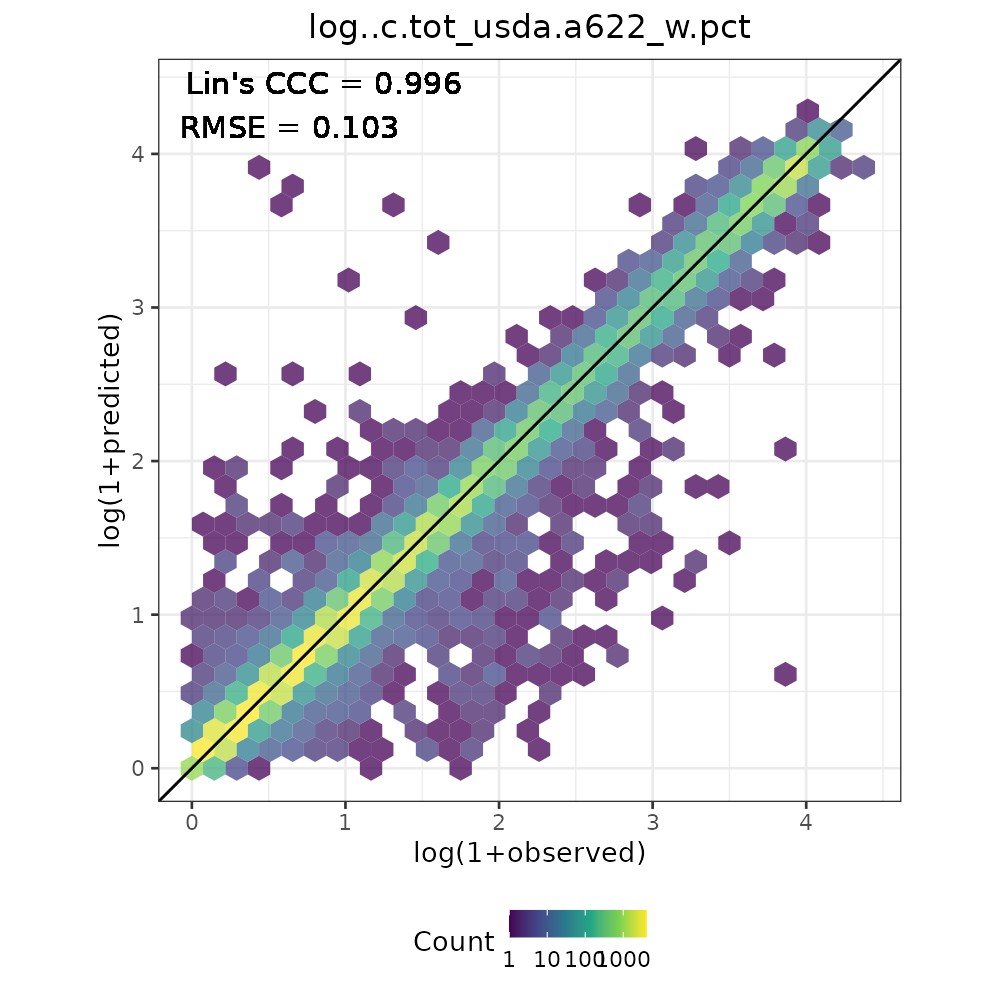

OSSL: Global Soil Spectral Calibration Models
================
Jose L. Safanelli (<jsafanelli@woodwellclimate.org>), Tomislav Hengl
(<tom.hengl@opengeohub.org>), Leandro Parente
(<leandro.parente@opengeohub.org>), and Jonathan Sanderman
(<jsanderman@woodwellclimate.org>)
04 December, 2023


[](https://doi.org/10.5281/zenodo.5759693)

[](https://soilspectroscopy.org/)

[](http://creativecommons.org/licenses/by-sa/4.0/)

This work is licensed under a [Creative Commons Attribution-ShareAlike
4.0 International
License](http://creativecommons.org/licenses/by-sa/4.0/).

## Open Soil Spectral Library

Part of: <https://github.com/soilspectroscopy>  
Project: [Soil Spectroscopy for Global
Good](https://soilspectroscopy.org)  
Last update: 2023-12-04  
Dataset:
[OSSL](https://soilspectroscopy.github.io/ossl-manual/ossl-database-description.html)

The directory/folder path:

``` r
# dir <- "/mnt/soilspec4gg/ossl/ossl_models/mlr3/"
dir <- "~/mnt-ossl/ossl_models/"
# db.dir <- "/mnt/soilspec4gg/ossl/ossl_import/"
db.dir <- "~/mnt-ossl/ossl_import/"
```

### Overview

This tutorial explains the steps required to fit Soil Spectral
Prediction Models for the purpose of the [Soil Spectroscopy for Global
Good project](https://soilspectroscopy.org) using the [MLR3
framework](https://mlr3book.mlr-org.com/). After running several model
evaluations, including the test of several instruments and diverse
independent test sets, we are releasing fine-tuned [Cubist
models](https://cran.r-project.org/web/packages/Cubist/vignettes/cubist.html),
a machine learning algorithm that takes advantage of a decision-tree
splitting method but fits linear regression models at each terminal
leaf. It also uses a boosting mechanism (sequential trees adjusted by
weights) that allows the growth of a forest by tuning the number of
committees. We haven’t used the correction of final predictions by the
nearest neighbors’ influence due to the lack of this feature in the MLR3
framework.

We provide, in addition to the response of a property of interest, the
uncertainty via the standard deviation estimation along with the lower
and upper bounds, determined via [conformal prediction
interval](https://en.wikipedia.org/wiki/Conformal_prediction). Lastly,
an extra column is provided to flag potential spectral
underrepresentation, warning if the feature space of the calibration set
is representative to new samples.

The following code is implemented in a high-performance computing
environment with many steps are fully parallelized with enough RAM (\>
64GB). Running this code on a standard computer without subsetting data
is not recommended.

For each soil property of interest, the possible model combinations are:

``` r
# MIR, VisNIR and NIR from Neospectra
spectra.type <- c("mir", "visnir", "nir.neospectra")

# Using KSSL only or the whole OSSL
subset <- c("kssl", "ossl")

# Adding (ll) or not adding (na) geocovariates to models
geocovariates <- c("na")

# Basic structure
modeling.combinations <- tibble(spectra_type = spectra.type) %>%
  crossing(subset = subset) %>%
  crossing(geo = geocovariates)
```

At this stage, Neospectra models are fitted using only the OSSL subset,
as they have minimal differences (OSSL \~ KSSL). In addition, models
with geocovariates are not implemented at this version as additional
tests are required.

``` r
# Target models
modeling.combinations <- modeling.combinations %>%
  dplyr::filter(!(grepl("neospectra", spectra_type) & subset == "kssl")) %>%
  dplyr::filter(!(geo == "ll"))

# Model name
modeling.combinations <- modeling.combinations %>%
  mutate(model_name = paste0(spectra_type, "_cubist_",
                             subset, "_", geo, "_v1.2"), .before = 1)

modeling.combinations %>%
  knitr::kable()
```

| model_name                         | spectra_type   | subset | geo |
|:-----------------------------------|:---------------|:-------|:----|
| mir_cubist_kssl_na_v1.2            | mir            | kssl   | na  |
| mir_cubist_ossl_na_v1.2            | mir            | ossl   | na  |
| nir.neospectra_cubist_ossl_na_v1.2 | nir.neospectra | ossl   | na  |
| visnir_cubist_kssl_na_v1.2         | visnir         | kssl   | na  |
| visnir_cubist_ossl_na_v1.2         | visnir         | ossl   | na  |

After database update v1.2, the following properties of interest have
models fitted:

``` r
soil.properties <- read_csv("../out/ossl_models_soil_properties.csv")

soil.properties <- soil.properties %>%
  filter(include == TRUE) %>%
  mutate(export_name = ifelse(log == TRUE, paste0("log..", soil_property), soil_property)) %>%
  select(-include, -log)

soil.properties.names <- soil.properties %>%
  pull(soil_property)

knitr::kable(soil.properties)
```

| soil_property                  | description                                         | export_name                         |
|:-------------------------------|:----------------------------------------------------|:------------------------------------|
| acidity_usda.a795_cmolc.kg     | Acidity, BaCl2-TEA Extractable, pH 8.2              | log..acidity_usda.a795_cmolc.kg     |
| aggstb_usda.a1_w.pct           | Aggregate Stability                                 | log..aggstb_usda.a1_w.pct           |
| al.dith_usda.a65_w.pct         | Aluminum, Crystalline, Total Pedogenic Iron         | log..al.dith_usda.a65_w.pct         |
| al.ext_usda.a1056_mg.kg        | Aluminum, Extractable, Mehlich3                     | log..al.ext_usda.a1056_mg.kg        |
| al.ext_usda.a69_cmolc.kg       | Aluminum, Extractable, KCl                          | log..al.ext_usda.a69_cmolc.kg       |
| al.ox_usda.a59_w.pct           | Aluminum, Amorphous, Total Non-Crystalline Iron     | log..al.ox_usda.a59_w.pct           |
| awc.33.1500kPa_usda.c80_w.frac | Available Water Content, Difference 33-1500 kPa     | log..awc.33.1500kPa_usda.c80_w.frac |
| b.ext_mel3_mg.kg               | Boron, Extractable, Mehlich3                        | log..b.ext_mel3_mg.kg               |
| bd_usda.a4_g.cm3               | Bulk Density, \<2mm fraction, Clod                  | log..bd_usda.a4_g.cm3               |
| c.tot_usda.a622_w.pct          | Carbon, Total NCS                                   | log..c.tot_usda.a622_w.pct          |
| ca.ext_usda.a1059_mg.kg        | Calcium, Extractable, Mehlich3                      | log..ca.ext_usda.a1059_mg.kg        |
| ca.ext_usda.a722_cmolc.kg      | Calcium, Extractable, NH4OAc                        | log..ca.ext_usda.a722_cmolc.kg      |
| caco3_usda.a54_w.pct           | Carbonate, \<2mm Fraction                           | log..caco3_usda.a54_w.pct           |
| cec_usda.a723_cmolc.kg         | CEC, pH 7.0, NH4OAc, 2M KCl displacement            | log..cec_usda.a723_cmolc.kg         |
| cf_usda.c236_w.pct             | Coarse Fragments, Greater 2mm                       | log..cf_usda.c236_w.pct             |
| clay.tot_usda.a334_w.pct       | Clay                                                | clay.tot_usda.a334_w.pct            |
| cu.ext_usda.a1063_mg.kg        | Copper, Extractable, Mehlich3                       | log..cu.ext_usda.a1063_mg.kg        |
| ec_usda.a364_ds.m              | Electrical Conductivity, (w/w)                      | log..ec_usda.a364_ds.m              |
| efferv_usda.a479_class         | Effervescense, 1N HCl                               | efferv_usda.a479_class              |
| fe.dith_usda.a66_w.pct         | Iron, Crystalline, Total Pedogenic Iron             | log..fe.dith_usda.a66_w.pct         |
| fe.ext_usda.a1064_mg.kg        | Iron, Extractable, Mehlich3                         | log..fe.ext_usda.a1064_mg.kg        |
| fe.ox_usda.a60_w.pct           | Iron, Amorphous, Total Non-Crystalline Iron         | log..fe.ox_usda.a60_w.pct           |
| k.ext_usda.a1065_mg.kg         | Potassium, Extractable, Mehlich3                    | log..k.ext_usda.a1065_mg.kg         |
| k.ext_usda.a725_cmolc.kg       | Potassium, Extractable, NH4OAc, 2M KCl displacement | log..k.ext_usda.a725_cmolc.kg       |
| mg.ext_usda.a1066_mg.kg        | Magnesium, Extractable, Mehlich3                    | log..mg.ext_usda.a1066_mg.kg        |
| mg.ext_usda.a724_cmolc.kg      | Magnesium, Extractable, NH4OAc, 2M KCl displacement | log..mg.ext_usda.a724_cmolc.kg      |
| mn.ext_usda.a1067_mg.kg        | Manganese, Extractable, Mehlich3                    | log..mn.ext_usda.a1067_mg.kg        |
| mn.ext_usda.a70_mg.kg          | Manganese, Extractable, KCl                         | log..mn.ext_usda.a70_mg.kg          |
| n.tot_usda.a623_w.pct          | Nitrogen, Total NCS                                 | log..n.tot_usda.a623_w.pct          |
| na.ext_usda.a1068_mg.kg        | Sodium, Extractable, Mehlich3                       | log..na.ext_usda.a1068_mg.kg        |
| na.ext_usda.a726_cmolc.kg      | Sodium, Extractable, NH4OAc, 2M KCl displacement    | log..na.ext_usda.a726_cmolc.kg      |
| oc_usda.c729_w.pct             | Organic Carbon, Total C without CaCO3, S prep       | log..oc_usda.c729_w.pct             |
| p.ext_usda.a274_mg.kg          | Phosphorus, Extractable, Olsen                      | log..p.ext_usda.a274_mg.kg          |
| p.ext_usda.a1070_mg.kg         | Phosphorus, Extractable, Mehlich3                   | log..p.ext_usda.a1070_mg.kg         |
| p.ext_usda.a270_mg.kg          | Phosphorus, Extractable, Bray1                      | log..p.ext_usda.a270_mg.kg          |
| ph.cacl2_usda.a481_index       | pH, 1:2 Soil-CaCl2 Suspension                       | ph.cacl2_usda.a481_index            |
| ph.h2o_usda.a268_index         | pH, 1:1 Soil-Water Suspension                       | ph.h2o_usda.a268_index              |
| s.tot_usda.a624_w.pct          | Sulfur, Total NCS                                   | log..s.tot_usda.a624_w.pct          |
| sand.tot_usda.c60_w.pct        | Sand, Total, S prep                                 | sand.tot_usda.c60_w.pct             |
| silt.tot_usda.c62_w.pct        | Silt, Total, S prep                                 | silt.tot_usda.c62_w.pct             |
| wr.1500kPa_usda.a417_w.pct     | Water Retention, 15 Bar (1500 kPa)                  | log..wr.1500kPa_usda.a417_w.pct     |
| wr.33kPa_usda.a415_w.pct       | Water Retention, 1/3 Bar (33 kPa)                   | log..wr.33kPa_usda.a415_w.pct       |
| zn.ext_usda.a1073_mg.kg        | Zinc, Extractable, Mehlich3                         | log..zn.ext_usda.a1073_mg.kg        |

> Note: some soil properties are natural-log transformed (with offset =
> 1, that is why we use log1p function) to increase the prediction
> performance of skewed distribution soil properties. They are
> back-transformed only at the end after running all modeling steps,
> including performance estimation and the definition of the uncertainty
> intervals.

Final modeling combinations:

``` r
modeling.combinations <- soil.properties %>%
  crossing(modeling.combinations)

write_csv(modeling.combinations, "../out/modeling_combinations_v1.2.csv")
```

## Spectral ranges

Few datasets from the OSSL have distinct spectral ranges. We strictly
define them in the chunk below and format the the OSSL naming. MIR is
represented in [log10 absorbance
units](https://soilspectroscopy.github.io/ossl-manual/ossl-database-description.html#mir-table),
while the VisNIR and NIR are represented in [reflectance
units](https://soilspectroscopy.github.io/ossl-manual/ossl-database-description.html#mir-table).

``` r
mir.spectral.range <- paste0("scan_mir.", seq(600, 4000, by = 2), "_abs")
visnir.spectral.range <- paste0("scan_visnir.", seq(400, 2500, by = 2), "_ref")
nir.neospectra.spectral.range <- paste0("scan_nir.", seq(1350, 2550, by = 2), "_ref")
```

## Checking folders

``` r
target.dirs <- paste0(dir, soil.properties$export_name)

# Folders already created?
invisible(sapply(target.dirs, function(x) {
  if(!dir.exists(x)){dir.create(x)}
}))
```

## Loading regression matrix

The regression-matrices were produced in the [OSSL-imports
repository](https://github.com/soilspectroscopy/ossl-imports).

``` r
## Reading OSSL level 1
rm.ossl <- qread(paste0(db.dir, "ossl_all_L1_v1.2.qs"))

# Preparing the bind of soil data level 1 for Neospectra 
neospectra.soillab <- rm.ossl %>%
  dplyr::select(id.layer_uuid_txt, id.scan_local_c,
                all_of(soil.properties.names)) %>%
  filter(grepl("XS|XN", id.scan_local_c)) %>%
  mutate(id.scan_local_c = gsub("XS|XN", "", id.scan_local_c))

# Keeping only the important columns
rm.ossl <- rm.ossl %>%
  dplyr::select(id.layer_uuid_txt, dataset.code_ascii_txt,
                any_of(soil.properties.names), all_of(visnir.spectral.range), all_of(mir.spectral.range))

# head(names(rm.ossl), 20)
# tail(names(rm.ossl), 20)

## Reading Neospectra datasets
neospectra.nir <- qread(paste0(db.dir, "neospectra_nir_v1.2.qs"))

# head(names(neospectra.nir), 20)

# Averaging spectra collected by multiple instruments
neospectra.nir <- neospectra.nir %>%
  dplyr::select(id.sample_local_c, all_of(nir.neospectra.spectral.range)) %>%
  group_by(id.sample_local_c) %>%
  summarise_all(mean)

rm.neospectra <- inner_join(neospectra.soillab, neospectra.nir,
                            by = c("id.scan_local_c" = "id.sample_local_c"))

# Selecting only important columns
rm.neospectra <- rm.neospectra %>%
  dplyr::select(id.layer_uuid_txt,
                any_of(soil.properties.names), all_of(nir.neospectra.spectral.range))

# Preparing named list of datasets
# Selecting only important columns, spectra range and rows with available spectra
data.list <- list(
  "mir_cubist_kssl_v1.2" = {rm.ossl %>%
      dplyr::filter(dataset.code_ascii_txt == "KSSL.SSL") %>%
      dplyr::select(id.layer_uuid_txt, any_of(soil.properties.names),
                    all_of(mir.spectral.range)) %>%
      dplyr::filter(!is.na(scan_mir.1500_abs))},
  "mir_cubist_ossl_v1.2" = {rm.ossl %>%
      dplyr::select(id.layer_uuid_txt, any_of(soil.properties.names),
                    all_of(mir.spectral.range)) %>%
      dplyr::filter(!is.na(scan_mir.1500_abs))},
  "visnir_cubist_kssl_v1.2" = {rm.ossl %>%
      dplyr::filter(dataset.code_ascii_txt == "KSSL.SSL") %>%
      dplyr::select(id.layer_uuid_txt, any_of(soil.properties.names),
                    all_of(visnir.spectral.range)) %>%
      dplyr::filter(!is.na(scan_visnir.1500_ref))},
  "visnir_cubist_ossl_v1.2" = {rm.ossl %>%
      dplyr::select(id.layer_uuid_txt, any_of(soil.properties.names),
                    all_of(visnir.spectral.range)) %>%
      dplyr::filter(!is.na(scan_visnir.1500_ref))},
  "nir.neospectra_cubist_ossl_v1.2" = {rm.neospectra %>%
      dplyr::select(id.layer_uuid_txt, any_of(soil.properties.names),
                    all_of(nir.neospectra.spectral.range)) %>%
      dplyr::filter(!is.na(scan_nir.1500_ref))}
  )

# # Different sizes
# lapply(data.list, function(x) dim(x))
```

### Preprocessing

To remove baseline offset, additive/multiplicative scattering effects,
and multicollinearity of spectra from multiple sources,
[SNV](https://cran.r-project.org/web/packages/prospectr/vignettes/prospectr.html#scatter-and-baseline-corrections)
preprocessing is used before PCA compression and model calibration:

``` r
prep.list <- lapply(data.list, function(x){
  x %>%
    dplyr::select(-id.layer_uuid_txt, -any_of(soil.properties.names)) %>%
    as.matrix() %>%
    prospectr::standardNormalVariate(X = .) %>%
    as_tibble() %>%
    bind_cols({x %>%
      dplyr::select(id.layer_uuid_txt, any_of(soil.properties.names))}, .)
  })

# # Checking preprocessing. Names are kept consistently across list objects and table columns
# lapply(data.list, function(x) dim(x))
```

### PCA compression

Compress and save [PCA
models](http://www.sthda.com/english/articles/31-principal-component-methods-in-r-practical-guide/118-principal-component-analysis-in-r-prcomp-vs-princomp/)
for the different versions of spectra. This is used to reduce the number
of dimension and also control multicollinearity ([Chang, Laird,
Mausbach, & Hurburgh Jr, 2001](#ref-chang2001near)). Only 120 components
will be used in the models but the remaining farther components are used
for the trustworthiness test, i.e., if a sample is underrepresented
because of their unique features on those farther components not
accounted by the models, then a flag will be raised.

Objects from `prcomp`:  
- `sdev`: the standard deviations of the principal components.  
- `rotation`: the matrix of variable loadings (columns are
eigenvectors).  
- `center`: the variable means (means that were substracted).  
- `scale`: the variable standard deviations (the scaling applied to each
variable).  
- `x`: the coordinates of the individuals (observations) on the
principal components, known as scores.

We can omit the `x` in the objects to save to disk, later reassigning
the class `prcomp` for making predictions.

Fit PCA models in parallel:

``` r
pca.list <- mclapply(1:length(prep.list), function(i) {
  
  x <- prep.list[[i]] %>%
    dplyr::select(starts_with("scan_")) %>%
    as.data.frame()
  
  prcomp(x, center = T, scale = T)
  
}, mc.cores = length(prep.list))

names(pca.list) <- names(prep.list)

# # Checking the number of components of each spectra type
# lapply(pca.list, function(x) ncol(x$rotation))
# 
# # Checking how many components explain 95% of the original variance
# lapply(pca.list, function(x) {which(cumsum(x$sdev/sum(x$sdev)) > 0.95)[1]})
# 
# # Checking how many components explain 99% of the original variance
# lapply(pca.list, function(x) {which(cumsum(x$sdev/sum(x$sdev)) > 0.99)[1]})
# 
# # Checking how many components explain 99.9%of the original variance
# lapply(pca.list, function(x) {which(cumsum(x$sdev/sum(x$sdev)) > 0.999)[1]})
# 
# # Checking how many components explain 99.99% of the original variance
# lapply(pca.list, function(x) {which(cumsum(x$sdev/sum(x$sdev)) > 0.9999)[1]})
```

Saving as `qs` files:

``` r
## Saving simplified pca models only for prediction purposes (m = modified):
# Omitting 5th object of prcomp, i.e x table (scores)
for(i in 1:length(pca.list)){
  qsave(pca.list[[i]][1:4], paste0(dir, "pca.ossl/mpca_", names(pca.list)[i], ".qs"))
}

## Saving the scores to be used as predictors
for(i in 1:length(pca.list)){
  
  idata <- prep.list[[i]] %>%
    dplyr::select(id.layer_uuid_txt, all_of(soil.properties.names))
  
  iscores <- pca.list[[i]]$x %>%
    as_tibble()
  
  idata.export <- bind_cols(idata, iscores)
  
  qsave(idata.export, paste0(dir, "pca.ossl/pca_scores_", names(pca.list)[i], ".qs"))
  
}
```

## Target models

``` r
modeling.combinations <- read_csv("../out/modeling_combinations_v1.2.csv")
count.table <- read_csv("../out/tab_dataset_count.csv")

# Defining available data from ossl-import
count.table <- count.table %>%
  filter(dataset %in% c("KSSL.SSL", "OSSL")) %>%
  rename(subset = dataset) %>%
  mutate(subset = recode(subset,
                         "KSSL.SSL" = "kssl",
                         "OSSL" = "ossl")) %>%
  pivot_longer(-all_of(c("soil_property", "subset")),
               names_to = "spectra_type", values_to = "count") %>%
  mutate(spectra_type = recode(spectra_type,
                               "n_mir" = "mir",
                               "n_visnir" = "visnir",
                               "n_neospectra" = "nir.neospectra"))

# Defining models with at least 500 observations
modeling.combinations <- left_join(modeling.combinations,
                                   count.table,
                                   by = c("soil_property", "spectra_type", "subset"))

modeling.combinations <- modeling.combinations %>%
  filter(count > 500) %>%
  filter(!(soil_property == "efferv_usda.a479_class"))

write_csv(modeling.combinations, "../out/fitted_modeling_combinations_v1.2.csv")

# Available soil properties
modeling.combinations %>%
  distinct(soil_property) %>%
  count()
```

    ## # A tibble: 1 × 1
    ##       n
    ##   <int>
    ## 1    42

``` r
# Final modeling combinations
modeling.combinations %>%
  count(spectra_type, subset)
```

    ## # A tibble: 5 × 3
    ##   spectra_type   subset     n
    ##   <chr>          <chr>  <int>
    ## 1 mir            kssl      41
    ## 2 mir            ossl      42
    ## 3 nir.neospectra ossl      29
    ## 4 visnir         kssl       6
    ## 5 visnir         ossl      23

## Model fitting

For model calibration we use the first 120 PCs, a cutoff considering the
trade-off between spectral representation and compression level. We did
a internal experiment and found this number to be optimal when compared
to a cumulative explained variance of 99% (which include more features
and hinders the compression capacity).

The use of compressed PCs is presented in Chang et al.
([2001](#ref-chang2001near)), although the authors used only top 10 PCA
components.

The following framework is used:  
- Base learner: Cubist (`cubist`). - Hyperparameter optimization is done
with internal resampling (`inner`) using 5-fold cross-validation and a
smaller subset for speeding up this operation. This task is performed
with a grid search of HP space testing up to 5 configurations within the
predifined range, and the is RMSE set as the loss function. A final
model is fitted at the end with the full data and the best HPO.  
- Performance evaluation is performed with an external (`outer`) 10-fold
cross-validation (`cv10`) of the final models.  
- Cross-validation predictions, accuracy plot, and good-of-fitness
metrics are exported to disk.  
- Uncertainty model via conformal prediction: the cross-validated
predictions are used to estimate absolute residuals (error), which are
fed to a new model using the same fine-tuned structure of the response
model. The observed and predicted errors are used to estimate conformity
scores given a confidence level (68% \~ 1 std dev, 90%, 95% etc.).

``` r
## Parallelization is done inside the the autotuner
lgr::get_logger("mlr3")$set_threshold("warn")

i=1
for(i in 1:nrow(modeling.combinations)) {

  isoil_property = modeling.combinations[[i,"soil_property"]]
  imodel_name = modeling.combinations[[i,"model_name"]]
  iexport_name = modeling.combinations[[i,"export_name"]]
  ispectra_type = modeling.combinations[[i,"spectra_type"]]
  isubset = modeling.combinations[[i,"subset"]]
  igeo = modeling.combinations[[i,"geo"]]

  # Learner
  learner_cubist = lrn("regr.cubist", predict_type = "response",
                       neighbors = 0, unbiased = FALSE, seed = 1993)

  # Hyperparameters space
  search_space_ensemble = ps(
    committees = p_int(1, 20) # Up to 20 tress are fitted sequentially
  )

  # PCA scores
  n.comps <- 120
  selected.comps <- paste0("PC", seq(1, n.comps, by = 1))

  data <- qread(paste0(dir, "pca.ossl/pca_scores_", ispectra_type, "_cubist_", isubset, "_v1.2.qs"))

  # Apply log transform to soil property
  if(grepl("log..", iexport_name)){

    data <- data %>%
      mutate(!!isoil_property := log1p(!!as.name(isoil_property)))

  }

  # Defining train data
  sel.data <- data %>%
    select(id.layer_uuid_txt, # ID column
           all_of(isoil_property), # Target
           all_of(selected.comps)) %>% # Only compressed spectra
    filter(!is.na(!!as.name(isoil_property)))

  # Subset for speeding up HPO
  if(nrow(sel.data) >= 2000) {

    set.seed(1993)
    sel.data.hpo <- sel.data %>%
      sample_n(2000)

  } else {

    sel.data.hpo <- sel.data

  }

  # Exporting train data

  export.data <- paste0(dir, iexport_name, "/task_", imodel_name, ".qs")
  export.data.alt <- gsub("\\.qs", "\\.rds", export.data)

  if(file.exists(export.data)){file.remove(export.data)}
  if(file.exists(export.data.alt)){file.remove(export.data.alt)}

  tryCatch(
    expr = {qsave(sel.data, export.data)},
    error = function(e){saveRDS(sel.data, export.data.alt)}
  )

  # Create regression task
  task.hpo <- as_task_regr(sel.data.hpo, id = "hpo", target = isoil_property, type = "regression")
  task.train <- as_task_regr(sel.data, id = "train", target = isoil_property, type = "regression")

  # Defining id column
  task.hpo$set_col_roles("id.layer_uuid_txt", roles = "name")
  task.train$set_col_roles("id.layer_uuid_txt", roles = "name")

  # For block CV. If 'id.tile' not present in the data.frame, default to random CV
  if("id.tile" %in% colnames(sel.data)) {
    task.hpo$set_col_roles("id.tile", roles = "group")
    task.train$set_col_roles("id.tile", roles = "group")
  }

  # Inner resampling for HPO with 5-fold cv
  inner_resampling = rsmp("cv", folds = 5)

  # Auto tuner
  # Grid search
  # Resolution 5 means that within the range, 5 equidistant values will be tested
  at = auto_tuner(tuner = tnr("grid_search", resolution = 5, batch_size = 1),
                  learner = learner_cubist,
                  resampling = inner_resampling,
                  measure = msr("regr.rmse"),
                  search_space = search_space_ensemble,
                  terminator = trm("none"),
                  store_models = FALSE)

  # Multicore processing
  future::plan("multisession")

  # Fit autotuner
  at$train(task.hpo)

  # # Overview
  # at$tuning_result
  # at$tuning_instance

  # Final model with best HPO
  final.model <- learner_cubist
  final.model$param_set$values = at$tuning_result$learner_param_vals[[1]]
  final.model$train(task.train)

  future:::ClusterRegistry("stop")

  # # Overview
  # summary(final.model$model$regr.lm$model)

  # Saving trained final model to disk
  export.model <- paste0(dir, iexport_name, "/model_", imodel_name, ".qs")
  export.model.alt <- gsub("\\.qs", "\\.rds", export.model)

  if(file.exists(export.model)){file.remove(export.model)}
  if(file.exists(export.model.alt)){file.remove(export.model.alt)}

  tryCatch(
    expr = {qsave(final.model, export.model)},
    error = function(e){saveRDS(final.model, export.model.alt)}
  )

}
```

## Model evaluation

We can export the summary accuracy statistics and standard plot
visualizations for all modeling combinations using 10-fold cross
validation.

``` r
fitted.modeling.combinations <- read_csv("../out/fitted_modeling_combinations_v1.2.csv")

## Evaluation pipeline
lgr::get_logger("mlr3")$set_threshold("warn")

i=1
for(i in 1:nrow(fitted.modeling.combinations)) {

  # Parameters
  isoil_property = fitted.modeling.combinations[[i,"soil_property"]]
  imodel_name = fitted.modeling.combinations[[i,"model_name"]]
  iexport_name = fitted.modeling.combinations[[i,"export_name"]]
  ispectra_type = fitted.modeling.combinations[[i,"spectra_type"]]
  isubset = fitted.modeling.combinations[[i,"subset"]]
  igeo = fitted.modeling.combinations[[i,"geo"]]

  cat(paste0("Run ", i, "/", nrow(fitted.modeling.combinations), " at ", lubridate::now(), "\n"))

  # Task
  sel.data <- qread(paste0(dir,
                           iexport_name,
                           "/task_",
                           imodel_name,
                           ".qs"))

  # Create regression task
  task <- as_task_regr(sel.data, id = "train",
                       target = isoil_property,
                       type = "regression")

  # Defining id column
  task$set_col_roles("id.layer_uuid_txt", roles = "name")

  # For block CV. If 'id.tile' not present in the data.frame, default to random CV
  if("id.tile" %in% colnames(sel.data)) {
    task$set_col_roles("id.tile", roles = "group")
  }

  # Autotuned model
  model <- qread(paste0(dir,
                        iexport_name,
                        "/model_",
                        imodel_name,
                        ".qs"))

  # Outer 10-CV evaluation
  tuned_learner <- as_learner(model$graph_model)

  future::plan("multisession")

  set.seed(1993)
  rr = mlr3::resample(task = task,
                      learner = tuned_learner,
                      resampling = rsmp("cv", folds = 10))

  cv.results <- lapply(1:length(rr$predictions("test")), function(i){
    as.data.table(rr$predictions("test")[[i]]) %>%
      mutate(fold = i)})

  cv.results <- Reduce(rbind, cv.results)

  cv.export <- left_join(task$row_names, cv.results, by = c("row_id" = "row_ids")) %>%
    rename(id.layer_uuid_txt = row_name) %>%
    select(-row_id)

  tryCatch(
    expr = {
      qsave(cv.export, paste0(dir,
                              iexport_name,
                              "/cvpred_",
                              imodel_name,
                              ".qs"))
    },
    error = function(e){
      write_csv(cv.export, paste0(dir,
                                  iexport_name,
                                  "/cvpred_",
                                  imodel_name,
                                  ".csv"))
    }
  )

  # Metrics
  performance.metrics <- cv.results %>%
    summarise(n = n(),
              rmse = rmse_vec(truth = truth, estimate = response),
              bias = msd_vec(truth = truth, estimate = response),
              rsq = rsq_vec(truth = truth, estimate = response),
              ccc = ccc_vec(truth = truth, estimate = response, bias = T),
              rpiq = rpiq_vec(truth = truth, estimate = response))

  perfomance.annotation <- paste0("Lin's CCC = ", round(performance.metrics[[1,"ccc"]], 3),
                                  "\nRMSE = ", round(performance.metrics[[1,"rmse"]], 3))

  performance.metrics <- performance.metrics %>%
    mutate(soil_property = isoil_property,
           model_name = imodel_name,
           .before = 1)

  write_csv(performance.metrics, paste0(dir,
                                        iexport_name,
                                        "/perfmetrics_",
                                        imodel_name,
                                        ".csv"))

  # Plot
  if(grepl("log..", iexport_name)) {

    p.hex <- ggplot(cv.results, aes(x = truth, y = response)) +
      geom_hex(bins = 30, alpha = 0.75) +
      geom_abline(intercept = 0, slope = 1) +
      geom_text(aes(x = -Inf, y = Inf, hjust = -0.1, vjust = 1.2),
                label = perfomance.annotation) +
      scale_fill_viridis_c(trans = "log10") +
      labs(x = "log(observed)", y = "log(predicted)", fill = "Count"),
           title = iexport_name) +
      theme_bw(base_size = 10) +
      theme(legend.position = "bottom",
            plot.title = element_text(hjust = 0.5),
            plot.subtitle = element_text(hjust = 0.5),
            legend.key.size = unit(0.35, "cm"))

    r.max <- max(layer_scales(p.hex)$x$range$range)
    r.min <- min(layer_scales(p.hex)$x$range$range)

    s.max <-max(layer_scales(p.hex)$y$range$range)
    s.min <-min(layer_scales(p.hex)$y$range$range)

    t.max <-round(max(r.max,s.max),1)
    t.min <-round(min(r.min,s.min),1)

    p.hex <- p.hex + coord_equal(xlim=c(t.min,t.max),ylim=c(t.min,t.max))

    ggsave(paste0(dir,
                  iexport_name,
                  "/valplot_",
                  imodel_name,
                  ".png"),
           p.hex, dpi = 200, width = 5, height = 5, units = "in", scale = 1)

  } else {

    p.hex <- ggplot(cv.results, aes(x = truth, y = response)) +
      geom_hex(bins = 30, alpha = 0.75) +
      geom_abline(intercept = 0, slope = 1) +
      geom_text(aes(x = -Inf, y = Inf, hjust = -0.1, vjust = 1.2),
                label = perfomance.annotation) +
      scale_fill_viridis_c(trans = "log10") +
      labs(x = "observed", y = "predicted", fill = fill = "Count"),
           title = iexport_name) +
      theme_bw(base_size = 10) +
      theme(legend.position = "bottom",
            plot.title = element_text(hjust = 0.5),
            plot.subtitle = element_text(hjust = 0.5),
            legend.key.size = unit(0.35, "cm"))

    r.max <- max(layer_scales(p.hex)$x$range$range)
    r.min <- min(layer_scales(p.hex)$x$range$range)

    s.max <-max(layer_scales(p.hex)$y$range$range)
    s.min <-min(layer_scales(p.hex)$y$range$range)

    t.max <-round(max(r.max,s.max),1)
    t.min <-round(min(r.min,s.min),1)

    p.hex <- p.hex + coord_equal(xlim=c(t.min,t.max),ylim=c(t.min,t.max))

    ggsave(paste0(dir,
                  iexport_name,
                  "/valplot_",
                  imodel_name,
                  ".png"),
           p.hex, dpi = 200, width = 5, height = 5, units = "in", scale = 1)

  }

  cat(paste0("Run ", i, "/", nrow(fitted.modeling.combinations), "\n\n"))

}
```

Example of an accuracy plot:



## Uncertainty model

``` r
## Parallelization is done inside the the autotuner
lgr::get_logger("mlr3")$set_threshold("warn")

i=1
for(i in 1:nrow(modeling.combinations)) {

  isoil_property = modeling.combinations[[i,"soil_property"]]
  imodel_name = modeling.combinations[[i,"model_name"]]
  iexport_name = modeling.combinations[[i,"export_name"]]
  ispectra_type = modeling.combinations[[i,"spectra_type"]]
  isubset = modeling.combinations[[i,"subset"]]
  igeo = modeling.combinations[[i,"geo"]]

  # PCA scores
  n.comps <- 120
  selected.comps <- paste0("PC", seq(1, n.comps, by = 1))

  data <- qread(paste0(dir, "pca.ossl/pca_scores_", ispectra_type, "_cubist_", isubset, "_v1.2.qs"))

  # CV predictions
  predictions <- qread(paste0(dir, iexport_name, "/cvpred_", imodel_name, ".qs"))

  predictions <- predictions %>%
    mutate(residual = abs(truth-response)) %>%
    select(id.layer_uuid_txt, residual)

  data <- right_join(data, predictions, by = "id.layer_uuid_txt") %>%
    relocate(residual, .after = id.layer_uuid_txt)

  # Defining train data
  sel.data <- data %>%
    select(id.layer_uuid_txt, # ID column
           residual, # Target
           all_of(selected.comps)) %>% # Only compressed spectra
    filter(!is.na(residual))

  # Create regression task
  task.error <- as_task_regr(sel.data, id = "train", target = "residual", type = "regression")

  # Defining id column
  task.error$set_col_roles("id.layer_uuid_txt", roles = "name")

  # For block CV. If 'id.tile' not present in the data.frame, default to random CV
  if("id.tile" %in% colnames(sel.data)) {
    task.error$set_col_roles("id.tile", roles = "group")
  }

  # Importing the best HP from prediction model and setting to error model
  error.model <- qread(paste0(dir, iexport_name, "/model_", imodel_name, ".qs"))

  # Train
  error.model$train(task.error)

  # Saving trained error model to disk
  export.file <- paste0(dir, iexport_name, "/error_model_", imodel_name, ".qs")
  export.file.alt <- gsub("\\.qs", "\\.rds", export.file)

  if(file.exists(export.file)){file.remove(export.file)}
  if(file.exists(export.file.alt)){file.remove(export.file.alt)}

  tryCatch(
    expr = {qsave(error.model, export.file)},
    error = function(e){saveRDS(error.model, export.file.alt)}
  )

  # Getting residual predictions and saving to disk
  results <- predict(error.model, newdata = as.data.table(task.error))

  pred.export <- sel.data %>%
    select(-starts_with("PC")) %>%
    mutate(pred_residual = results) %>%
    mutate(alpha_scores = residual/pred_residual)

  export.error <- paste0(dir, iexport_name, "/error_pred_", imodel_name, ".qs")
  export.error.alt <- gsub("\\.qs", "\\.rds", export.error)

  if(file.exists(export.error)){file.remove(export.error)}
  if(file.exists(export.error.alt)){file.remove(export.error.alt)}

  tryCatch(
    expr = {qsave(pred.export, export.error)},
    error = function(e){saveRDS(pred.export, export.error.alt)}
  )

  cat(paste0("Exported error model at ", now(), "\n\n"))

}
```

## References

<div id="refs" class="references csl-bib-body hanging-indent"
line-spacing="2">

<div id="ref-chang2001near" class="csl-entry">

Chang, C.-W., Laird, D., Mausbach, M. J., & Hurburgh Jr, C. R. (2001).
Near-infrared reflectance spectroscopy–principal components regression
analyses of soil properties. *Soil Science Society of America Journal*,
*65*(2), 480.
doi:[10.2136/sssaj2001.652480x](https://doi.org/10.2136/sssaj2001.652480x)

</div>

</div>
